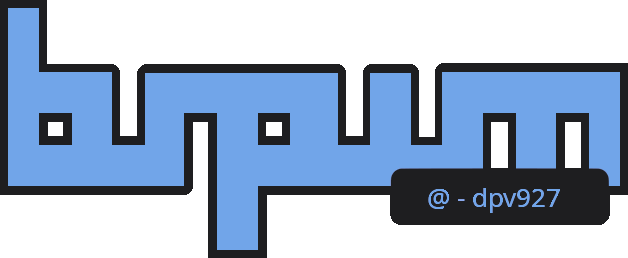

<div class='logo' align='center'>
    <!-- Repo logo | bspwm @dpv927  -->
    
</div>

<div class='preview'>
    <!-- Theme preview -->
    <br>
</div>

<h1>
  <a href="#--------">
    
  </a>
  <a href="#--------">
    
  </a>
</h1>
<br>

This repository contains a color theme mainly designed for Archcraft, an Archlinux distribution. 
Below you can find a guide to install this theme on your system and apply it, as well as the color theme for GTK and system icons.

## Table of Contents

- <a href="#installing-the-theme">Installing the theme</a>
- <a href="#installing-the-gtk-theme">Installing the GTK theme</a>
- <a href="#installing-the-icon-theme">Installing the icon theme</a>
- <a href="#changing-the-lockscreen">Changing the lockscreen</a>
- <a href="#applying-the-theme">Applying the theme</a>
- <a href="#license">License</a>
  
## Installing the theme

You have to clone this repository, then copy the theme into the appropriate path on your system. Before this, as during the guide you will download several files, it would be correct to make a directory to save these temporary files and then delete them:

```bash
# Make the directory and enter
cd && mkdir dpv-theme-files

# Clone the repo
cd dpv-theme-files
git clone https://github.com/dpv927/dotfiles.git
```

Now you have to copy the theme to the path of your archcraft system where all the themes are stored:

```bash
# Define your screen resolution with one of the following variables: 
# SCR_RES="1366x768"
SCR_RES="3840x2160"
cp -r dotfiles/${SCR_RES}/theme/ ~/.config/bspwm/themes

# If you want to, you can change the name of the theme
THEME_NAME="theme-name"
mv ~/.config/bspwm/themes/theme ~/.config/bspwm/themes/${THEME_NAME}
```

Finally, if you are using a big resolution like 3840x2160px, copy the contents of my Xresources file to fix the cursor size:

```bash
cat dotfiles/${SCR_RES}/.Xresources >> ~/.Xresources
```

## Installing the GTK theme

I use the official Catppuccin theme for GTK. You can install it with <a href="https://aur.archlinux.org/packages/yay">yay</a>:

```bash
yay -S catppuccin-gtk-theme-frappe
```

## Installing the icon theme

The theme I use for the system icons is the official <a href="https://github.com/catppuccin/papirus-folders">Catppuccin</a> theme. First you need to have the <a href="https://github.com/PapirusDevelopmentTeam/papirus-icon-theme">Papirus</a> icon theme, which is installed with the following command:

```bash
wget -qO- https://git.io/papirus-icon-theme-install | sh
```

Finally we installed the Catppuccin theme:

```bash
# Clone the theme's files
git clone https://github.com/catppuccin/papirus-folders.git

# Install the theme
sudo cp -r papirus-folders/src/* /usr/share/icons/Papirus
./papirus-folders/papirus-folders -C cat-frappe-lavender --theme Papirus-Dark
```

## Changing the lockscreen

Maybe you want to change the onedark theme lockscreen to match the desktop theme. If you want so, make the next changes to the <a href="">sddm</a> theme:

 ```bash
# First, be shure to be at the dpv-theme-files directory
sudo cp dotfiles/resources/waves.png /usr/share/sddm/themes/archcraft/Backgrounds/
sudo sed -i 's/Backgrounds\/bg-1.png/Backgrounds\/waves.png/g' /usr/share/sddm/themes/archcraft/theme.conf
```

Then you can also change the lockscreen that appears when you suspend the computer:

```bash
betterlockscreen -u dotfiles/resources/waves.png
```

## Applying the theme

Applying the theme is very simple, just press the ``Win+t`` keys (that is the default combination) or run the theme script:

```bash
cd ~/.config/bspwm/themes/${THEME_NAME} && ./apply.sh
```

## License

This repository is not licensed under any license since the files are largely based on the initial Archcraft configuration and the color schemes come from Catppuccin.
