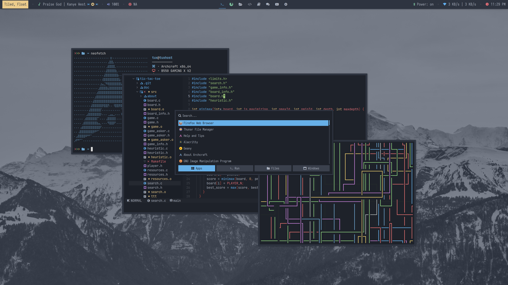

# archcraft.cfg

## About
This is a small configuration for <a href="https://archcraft.io/">Archcraft</a>, changing some settings like the order of elements in <a href="https://github.com/polybar/polybar">Polybar</a>, the space between windows, and a border to simulate a smoother feel in the windows.

Furthermore, the color theme has been modified from the default One Dark-based theme that Archcraft had to a more striking and darker one that better follows the color scheme of the original theme. Therefore, the applications that have been modified are: <a href="https://github.com/polybar/polybar">polybar</a>, <a href="https://github.com/baskerville/bspwm">bspwm</a>, <a href="https://github.com/davatorium/rofi">rofi</a> (all its menus), <a href="https://alacritty.org/">alacritty</a> and <a href="https://nvchad.com/">neovim</a> (changed to Nvchad config).
