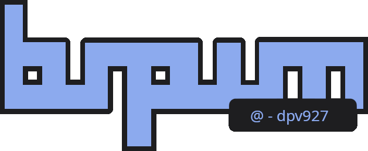
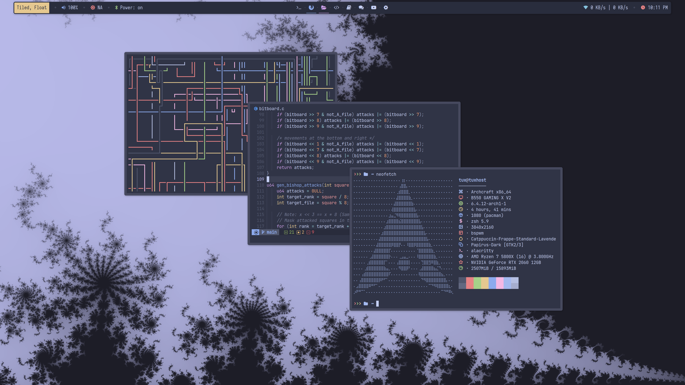
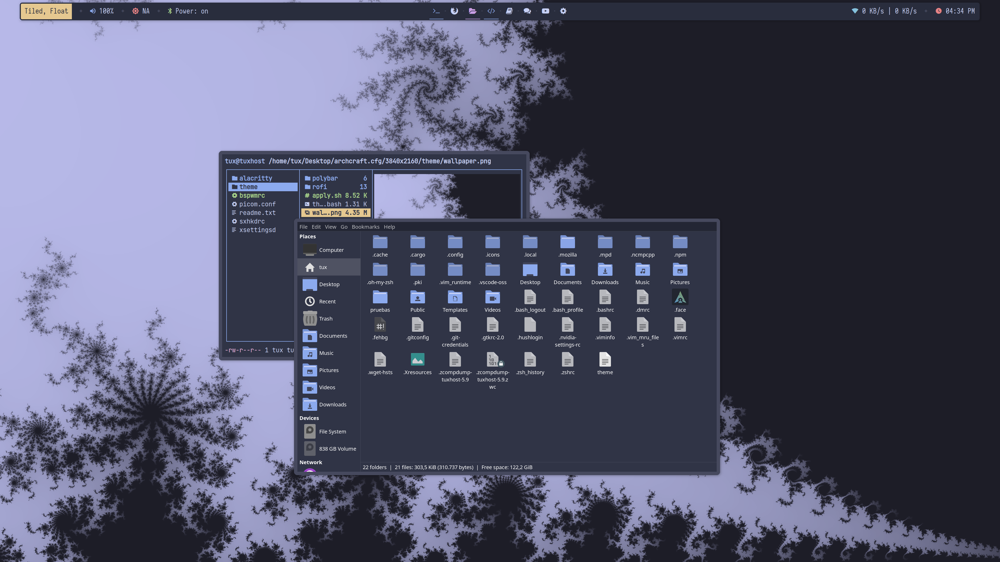

<div class='logo' align='center'>
    <!-- Repo logo | bspwm @dpv927  -->
    
</div>

<div class='preview'>
    <!-- Theme preview- might add thunar, ranger.. -->
    <br>
    <br>
</div>

<h1>
  <a href="#--------">
    
  </a>
  <a href="#--------">
    
  </a>
</h1>
<br>


This repository contains a color theme mainly designed for Archcraft, an Archlinux distribution. 
Below you can find a guide to install this theme on your system and apply it, as well as the color theme for GTK and system icons.

## Table of Contents

- <a href="#information">Information</a>
- <a href="#installing-the-theme">Installing the theme</a>
- <a href="#applying-the-theme">Applying the theme</a>
- <a href="#installing-the-gtk-theme">Installing the GTK theme</a>
- <a href="#installing-the-icon-theme">Installing the icon theme</a>
- <a href="#lvim-config">Lvim config</a>
- <a href="#license">License</a>
  
## Installing the theme

You have to clone this repository, then copy the theme into the appropriate path on your system. Before this, as during the guide you will download several files, it would be correct to make a directory to save these temporary files and then delete them:

```bash
# Make the directory and enter
cd && mkdir dpv-theme-files

# Clone the repo
cd dpv-theme-files
git clone https://github.com/dpv927/dotfiles.git && cd dotfiles
```

Now you have to copy the theme to the path of your archcraft system where all the themes are stored:

```bash
# Define your screen resolution with one of the following variables: 
# SCR_RES="1366x768"
SCR_RES="3840x2160"
cp -r dotfiles/${SCR_RES}/theme/ ~/.config/bspwm/themes

# If you want to, you can change the name of the topic
THEME_NAME="theme-name"
mv ~/.config/bspwm/themes/theme ~/.config/bspwm/themes/${THEME_NAME}
```

Finally, copy the contents of my Xresources file to fix the cursor size:

```bash
cat dotfiles/${SCR_RES}/.Xresources >> ~/.Xresources
```

## Installing the GTK theme


```bash
yay -S catppuccin-gtk-theme-frappe
```

## Installing the icon theme

The theme I use for the system icons is the official <a href="https://github.com/catppuccin/papirus-folders">Catppuccin</a> theme. First you need to have the <a href="https://github.com/PapirusDevelopmentTeam/papirus-icon-theme">Papirus</a> icon theme, which is installed with the following command:

```bash
wget -qO- https://git.io/papirus-icon-theme-install | sh
```

Finally we installed the Catppuccin theme:

```bash
# Enter the file directory again
cd ~/dpv-theme-files

# Clone and install the theme's files
git clone https://github.com/catppuccin/papirus-folders.git && cd papirus-folders
sudo cp -r src/* /usr/share/icons/Papirus
./papirus-folders -C cat-frappe-lavender --theme Papirus-Dark
```

## Applying the theme

Applying the theme is very simple, just press the ``Win+t`` keys (that is the default combination) or run the theme script:

```bash
cd ~/.config/bspwm/themes/${THEME_NAME} && ./apply.sh
```

## Lvim config
Optionally you can install my configuration for LunarVim, which is a very useful and elegant distribution of Neovim. To do so, install Lunarvim as indicated in its official page and copy my configuration:

```bash
cp -r ~/cd dpv-theme-files/dotfiles/lvim/ ~/.config
```

## License

This repository is not licensed under any license since the files are largely based on the initial Archcraft configuration and the color schemes come from Catppuccin.