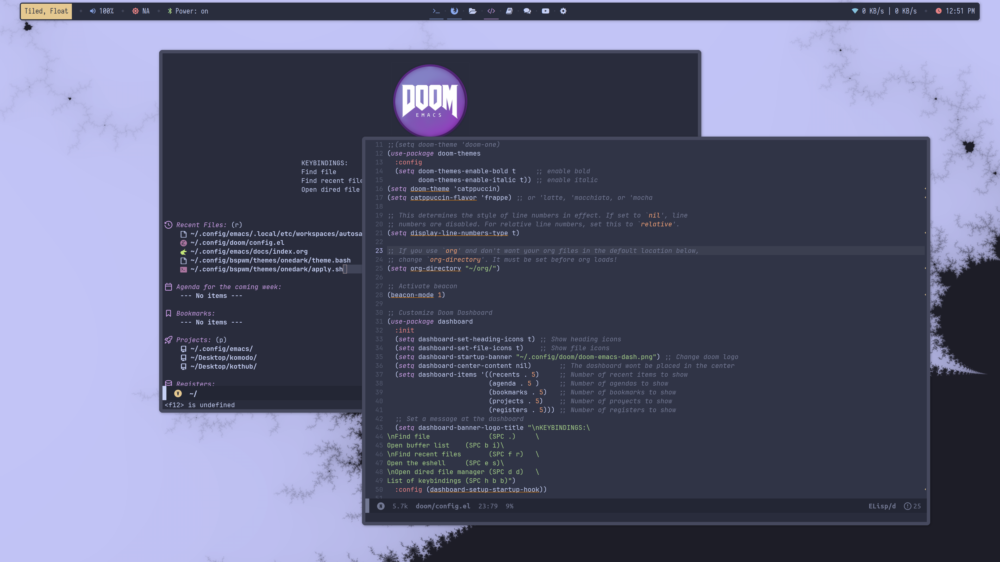

# <picture></picture> **Doom Emacs**

<!-- Doom emacs preview -->


## Contents
- <a href="http://a.com">About</a>
- <a href="http://a.com">Pre-install</a>
- <a href="http://a.com">Installation</a>
- <a href="http://a.com">Post-install</a>
- <a href="http://a.com">Credits</a>

## About

This is my configuration for <a href="https://github.com/doomemacs/doomemacs">Doom Emacs</a>,
which is a framework for <a href="https://www.gnu.org/software/emacs/">Emacs</a> with many 
utilities and features that greatly facilitate coding and other tasks.

Much of this configuration was taken from <a href="https://www.youtube.com/@DistroTube">Distrotube (dt)</a>,
since in his videos he offers very clear explanations on how to configure Emacs and the 
utilities of its best plugins.

## Pre-install

First of all you will need to install some fonts that I use in my configuration: 

```bash
sudo pacman -S ttf-jetbrains-mono ttf-ubuntu-font-family
```

## Installation

We will need to install Emacs, of course, and then Doom Emacs on top of it:

```bash
# Install Emacs
sudo pacman -S emacs

# Install Doom Emacs
git clone --depth 1 https://github.com/doomemacs/doomemacs ~/.config/emacs
~/.config/emacs/bin/doom install

# Update Doom Emacs packages
~/.config/emacs/bin/doom sync
```

Now you can copy my configuration to your Doom directory and finish:

```bash
# Copy my config files
cp -r $(PATH_TO_MY_DOTFILES)/doom ~/.config/

# Now you must sync again
~/.config/emacs/bin/doom sync
```

You may notice that when you start Emacs, the modeline fonts are not displayed correctly.
To fix this, run the following command (in Emacs): 

```
M-x nerd-icons-install-fonts # M-x Same as Alt + x
```

## Post-install

Now you may want to add some extra settings. An example might be to add a
key combination to open Emacs:

```bash
# Add this to your sx
super + e
  emacs
```

By default Emacs is displayed in Archcraft in a *floating* position, so you want to 
change it to *tiled* or normal mode and assign it to the code workspace:

```bash
# Edit this at your bspwmrc
declare -a code=(Emacs)
bspc rule -a Emacs desktop='^4' follow=on focus=on state=tiled
```

To finish with the .bspwmrc file, you can add the following line at the end so that
the emacs daemon is loaded at startup and emacs opens faster:

```bash
# Add this to the end of .bspwmrc
emacs-daemon
```

To make the process of opening emacs even easier, I recommend that you add the 
following lines to your .bashrc or .zshrc:

```bash
# Add doom Emacs dir to path
PATH="/home/tux/.config/emacs/bin:$PATH"

# Add some aliases
alias emacs="emacsclient -c -a 'emacs'"      # Emacs GUI
alias emacs-daemon="/usr/bin/emacs --daemon" # Emacs daemon
alias emacst="/usr/bin/emacs -nw"            # Emacs in terminal
```

## Credits

As mentioned above, much of the configuration is given by the explanations and 
code provided by Distrotube, both in his <a href="https://www.youtube.com/@DistroTube">Youtube channel</a>
and in his <a href="https://gitlab.com/dwt1">repository</a>.
